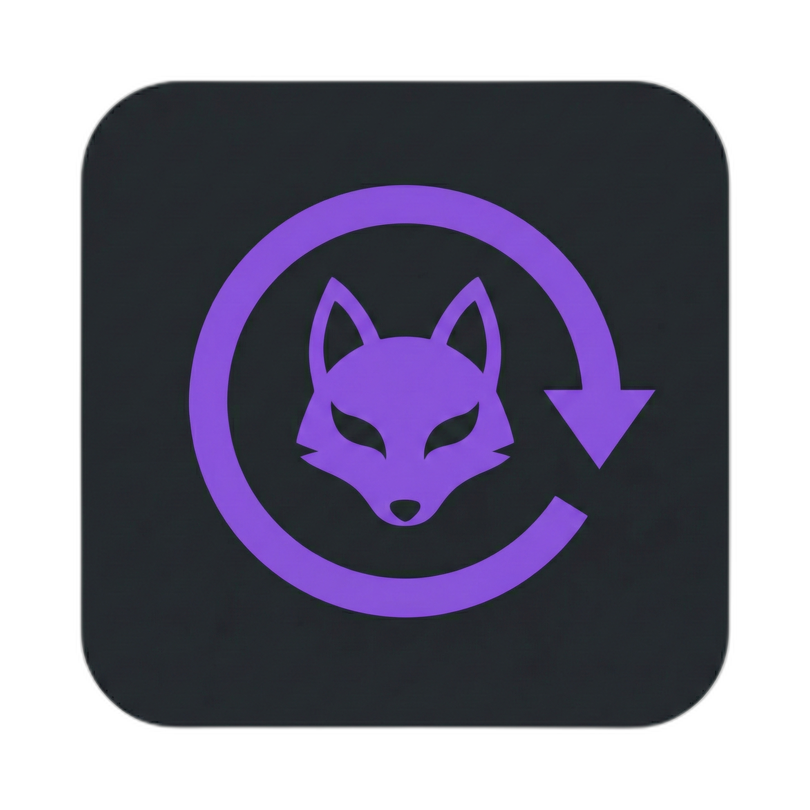
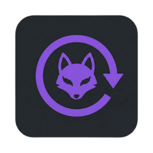

# Kitsune Download Manager

<p align="center">
  
</p>

<p align="center">
  
</p>

<p align="center">
  <a href="LICENSE"></a>
  
  
  
</p>

**Kitsune** is a cross-platform download manager focused on native performance and seamless browser integration. It pairs a Rust download engine, running as a sidecar process, with an Electron desktop app and a browser extension bridge.

## Highlights

- **Native performance** with Rust (`kitsune-core`) for efficient I/O and concurrency.
- **Direct browser integration** via Native Messaging for Chromium, Chrome, and Edge.
- **Cross-platform installers** for Linux (`.deb` and `.pkg.tar.zst`) and Windows.
- **Smart setup** that registers native host manifests automatically during installation.
- **Deep-link support** for `kitsune://` protocol triggers.

---

## Installation

### Linux



#### Debian / Ubuntu / Mint
Download the `.deb` package and install it. Post-install scripts handle browser host registration.

```bash
sudo apt install ./Kitsune_Download_Manager_0.1.0_amd64.deb
```

#### Arch Linux / Manjaro
Download the `.pkg.tar.zst` package and install it. Install hooks generate and register manifests automatically.

```bash
sudo pacman -U kitsune-dm-v0.1.0-linux-x86_64.pkg.tar.zst
```

### Windows


1. Download and run the **installer** (`.exe`).
2. The installer configures `HKCU\Software\...\NativeMessagingHosts\com.kitsune.dm` automatically.

### Browser Extension (Developer Mode)

1. Open your extensions page (for example `chrome://extensions`).
2. Enable **Developer Mode**.
3. Click **Load unpacked** and select the `extension/` directory.
4. The extension connects to the installed Kitsune desktop app.

---

## Development

### Prerequisites

#### General
- **Rust**: `rustup` (stable)
- **Node.js**: v18+ (managed via `npm`)

#### Linux
Electron ships its own Chromium, so no WebKit or GTK development packages are
needed. Packaging the `.deb` and `.pkg.tar.zst` locally needs:

```bash
# Debian / Ubuntu
sudo apt install build-essential fakeroot dpkg

# Arch Linux
sudo pacman -S base-devel fakeroot
```

#### Windows
No extra tooling. electron-builder downloads NSIS itself.

> **Note:** the Windows installer cannot be built on Linux — electron-builder
> runs `rcedit` under wine and its bundled `makensis.exe` is a Windows binary.
> Build it on Windows or in CI.

### Build

1. **Clone the repository:**
   ```bash
   git clone https://github.com/OliverMarcusson/Kitsune-Download-Manager.git
   cd Kitsune-Download-Manager
   ```

2. **Install dependencies:**
   ```bash
   npm run install:app
   ```

3. **Build the Rust sidecar** (the app will not start without it):
   ```bash
   npm run build:rust
   ```

4. **Run development mode:**
   ```bash
   npm run dev
   ```

5. **Build production packages:**

   **Linux (deb, pacman, AppImage):**
   ```bash
   npm run dist:linux
   ```

   **Windows (NSIS installer):**
   ```bash
   npm run dist:win
   ```

   Output for both: `app/dist/`

---

## Release Process

- **Trigger:** GitHub Actions release workflow runs on tag pushes that match `v*` (enforced tag format: `vMAJOR.MINOR.PATCH` with an optional `-<prerelease>` suffix; examples: `v1.4.2`, `v1.5.0-rc.1`).
- **Version sync guardrail:** Release fails fast unless tag version (including any prerelease suffix) exactly matches all configured versions in `package.json` and `app/package.json`.
- **Prerelease handling:** Prerelease status is derived from the tag by `scripts/detect-release-prerelease.mjs`; prerelease tags (for example `v1.5.0-rc.1`) are published as GitHub prereleases.
- **Required release assets:** the workflow normalizes the final GitHub release assets to exactly: `kitsune-dm-v{version}-windows-x64.exe`, `kitsune-dm-v{version}-linux-amd64.deb`, `kitsune-dm-v{version}-linux-x86_64.pkg.tar.zst`, plus `SHA256SUMS` (sha256 checksums for each normalized asset).
- **Deterministic publish set:** normalized assets are validated so the publish directory and final GitHub release contain exactly those four assets, with no extras.
- **Idempotent reruns:** rerunning the same tag updates or reuses the release, removes unmanaged old assets, and re-uploads managed assets using overwrite semantics (`gh release upload --clobber`).
- **Out of scope:** artifact signing and publishing to external package repositories are not performed by this workflow.

---

## Architecture

The project is a Cargo workspace plus an Electron app. The Rust engine runs as a
sidecar process; Electron's main process talks to it over newline-delimited JSON
on stdio. See [app/README.md](app/README.md) for the details.

| Component | Path | Description |
|-----------|------|-------------|
| **kitsune-core** | `crates/core` | Shared business logic, download engine, and session management. |
| **kitsune-daemon** | `crates/daemon` | Sidecar process wrapping `kitsune-core` behind a JSON stdio protocol. |
| **kitsune-shim** | `crates/shim` | Native messaging host that receives browser messages on `stdio` and forwards them via IPC. |
| **kitsune-cli** | `crates/cli` | CLI tools, including the `native-host-manifest` generator used by installers. |
| **app** | `app` | Electron desktop app (React/TypeScript renderer + main process). |

---

## License

MIT License. See [LICENSE](LICENSE).
